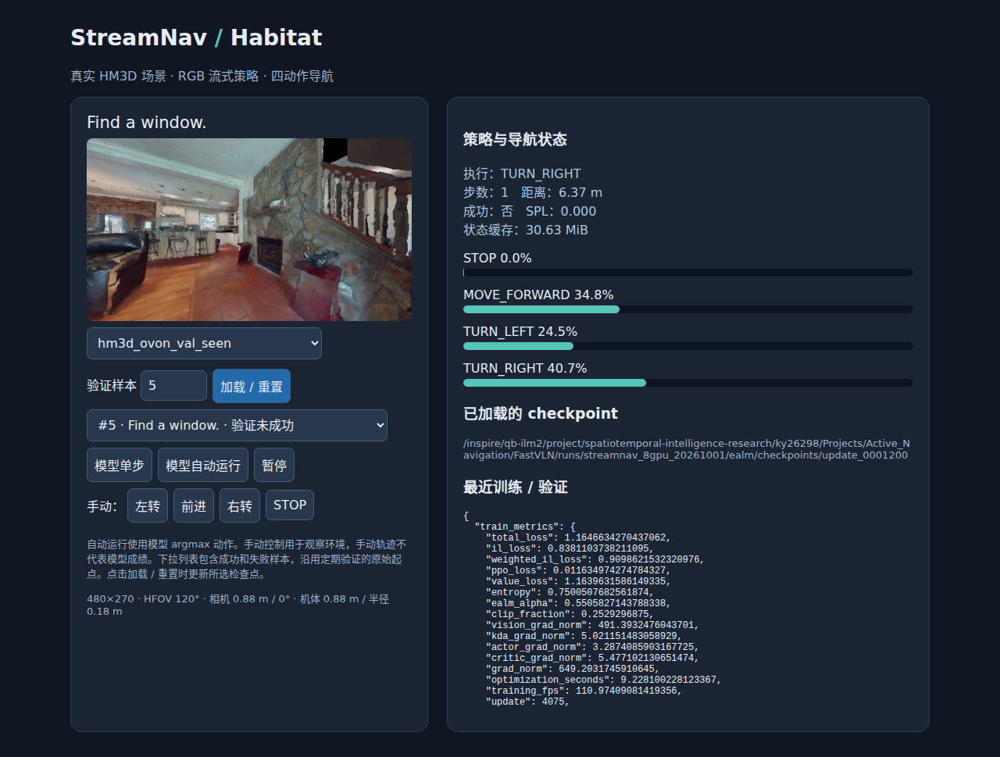

# FastVLN / Streaming ObjectNav

基于 **KDA-converted Qwen3.5-0.8B** 的 RGB 流式 ObjectNav 策略。每个 episode 只预填一次目标指令，随后只处理当前 RGB 与固定大小的递归状态，直接输出 `STOP / MOVE_FORWARD / TURN_LEFT / TURN_RIGHT`。视觉编码器、递归主干、actor 和 critic 在同一训练器中联合更新。

已实现真实 Habitat-Sim 在线 rollout、DAgger oracle、PPO、entropy-adaptive IL/RL mixing、混合 HM3D 数据、断点续训、定期验证、视频导出和浏览器仿真器可视化。2026-10-01 审计发现旧训练约 5,600 updates 后仍无自主成功，已停止。进一步定位到 oracle 在近目标处反复旋转及课程 reset 异常；监控、验证取样和网页权重刷新问题也已修复。2026-10-02 已从完整检查点恢复 revision 3 的 8 卡训练；仍处于低成功率阶段，尚未达到 OVSegDT 水平。续训与排查见 [10 月 2 日记录](docs/training_resume_20261002.md)。详见 [8 卡训练与 oracle 根因审计](docs/training_8gpu_20261001.md) 和 [首次训练审计](docs/training_audit_20261001.md)。

**最近完整验证（update 4100）：** 主实验 seen / synonyms / unseen 分别为 **3/48、1/48、5/48**，宏平均 SR **6.25%**；固定混合对照为 **3/48、2/48、2/48**，宏平均 **4.86%**。本轮三个分集均非零，但仍有长期低成功率告警。主实验历史最佳为 update 1200 的 **12/144（8.33%）**。这只是三个固定诊断子集上的成绩，尚未解决效果停滞问题。实时更新请运行 `python tools/training_status.py`；进程状态会重新核验，旧快照不能代表仍在运行。

## 当前机器人参数

| 参数 | 当前值 |
|---|---|
| RGB 宽 × 高 | **480 × 270** |
| HFOV | **120°** |
| 相机高度 / 俯仰 | **0.88 m / 0°** |
| 机体高度 / 半径 | **0.88 m / 0.18 m** |

相机原始图像完整保留；模型只在上下各补 9 行到 480×288，不裁剪、不拉伸，产生 135 个合并视觉 token。导航网格也按真实机体尺寸重建，并缓存到 `runtime/cache/navmesh`；仅修改 AgentConfiguration 不会改变原网格的碰撞尺寸。训练、验证、视频和网页均使用这套参数。

当前主实验为 `runs/streamnav_active/ealm`，对照为 `runs/streamnav_active/fixed_mix`，别名指向 `runs/streamnav_8gpu_20261002`，分别从旧实验 update 4025 / 4050 续训。优化器、调度、RNG 和 sampler 已恢复；仿真 episode 重新开始。原始日志不删除，主实验未保存到检查点的 4026–4035 记录保留在旧目录，续训沿革见各目录 `continuation.json`。旧 `streamnav_sensor480x270*` 已停止并标记学习失败，保留作为诊断证据；更早使用错误碰撞网格的实验已清理。机器人参数和历史单卡性能基准见 [传感器更新记录](docs/sensor_update_20260930.md)。

## 当前工作目录与环境

```bash
cd /inspire/qb-ilm2/project/spatiotemporal-intelligence-research/ky26298/Projects/Active_Navigation/FastVLN
source scripts/env.sh
```

`source` 命令使用 Bash；如果交互终端是 zsh，可以先运行 `bash`。依赖和所有新增大文件都位于这个项目目录下：

| 路径 | 内容 |
|---|---|
| `.venv/` | Python 3.12 learner；只读复用现有 Torch 2.10.0+cu126 |
| `runtime/habitat-env/` | Python 3.9、Habitat-Sim 0.3.3 headless；与 learner 独立 |
| `runtime/cache/` | pip、uv、HF、Conda、Triton、Torch 缓存 |
| `runtime/data/` | 解压后的场景、episode、manifest |
| `checkpoints/qwen35_0p8b_kda/` | 独立转换得到的初始化权重 |
| `runs/streamnav_active/ealm/` | 主实验日志、检查点、验证指标和视频 |
| `runtime/reports/` | GPU 延迟等验证产物 |

原始 Qwen 权重从 `../../pure_checkpoints/Qwen/Qwen3.5-0.8B` 对应的共享目录读取，原始场景来自 `/inspire/dataset/hm3d/v1`；不修改这些原文件。新装环境可运行 `bash scripts/setup.sh`。指定其他已有 Python/Conda 时设置 `STREAMNAV_BASE_PYTHON`、`STREAMNAV_CONDA`。`uv.lock` 提供 Linux CUDA 12.6 的依赖锁；独立安装可用 `uv sync --locked --extra dev`。

本项目不读取语义分割输入，也不需要下载语义网格来训练：官方 episode 已包含用于 oracle/reward 的目标视点。`.config` 凭据不进入代码、配置、checkpoint 或日志。原仓库已经追踪了 `.config/matterport.json`，发布仓库前需要由仓库所有者清理该凭据的追踪记录和历史。

## 启动、查看和停止训练

```bash
# GPU 0–3 主实验，GPU 4–7 固定混合对照
# 完整停止后，从与日志最后 update 一致的 latest 恢复；正在运行会拒绝重复启动
STREAMNAV_RESUME=1 bash scripts/start_eight_gpu_training.sh

# 全新实验必须另设目录
# STREAMNAV_RUN_ROOT=runs/my_new_experiment bash scripts/start_eight_gpu_training.sh

# 查看两组进程、更新数、自主验证与 8 卡利用率
python tools/training_status.py
tail -f runs/streamnav_active/ealm/training.log
cat runs/streamnav_active/ealm/health_status.json

# 完成当前 update / 验证后，四个 rank 一起保存并退出
bash scripts/stop_training.sh runs/streamnav_active/ealm
bash scripts/stop_training.sh runs/streamnav_active/fixed_mix

# 恢复主实验；对照需更改 run_dir、gpu_offset 和 checkpoint，并设 ealm.enabled=false
STREAMNAV_RUN_DIR=runs/streamnav_active/ealm \
STREAMNAV_WORLD_SIZE=4 STREAMNAV_GPU_OFFSET=0 \
  bash scripts/start_distributed_training.sh \
  checkpoint=runs/streamnav_active/ealm/checkpoints/latest
```

后台启动器创建独立 OS session，不依赖聊天连接。每个实验有 4 个同步 DDP learner，每卡 8 个 Habitat 环境，共 **32 环境 × 16 steps = 512 个新 transitions/update**，两组共 64 个训练环境。rank 使用独立采样 seed，共享同步后的模型参数；梯度在裁剪与 AdamW 更新前求平均，全局归一化 advantage 和 STOP 类权重。默认 10,000 updates，每组 5.12M 新 transitions；长度 4 的连续序列、每卡 sequence batch size 8、重放 2 epochs。FP32 梯度通过 NCCL 分桶同步，通信与反向计算重叠。两组位于各自 NUMA 节点对应的 GPU 组，避免组间同步。实际配置、worker PID 与代码快照保存在实验目录。单卡调试可用 `scripts/start_training.sh`，默认另用 `runs/streamnav_single_gpu`。

训练从第一个 update 就计算统一 IL/PPO/value/entropy objective；无 BC 预训练阶段。master 参数和 AdamW moments 保持 FP32，计算使用 BF16 autocast。`freeze_vision_encoder=false`，主干参与训练。日志记录各分支梯度、IL/PPO/value loss、entropy、EALM alpha、DAgger beta、动作分布、碰撞、样本吞吐和显存；分别记录 sampled / greedy 动作分布、各类 oracle 召回率和相对类别先验的 IL 改善量；greedy 动作坍缩会产生告警。STOP 类 IL 权重为 8，其他为 1；主干 / 视觉 / head 学习率分别为 3e-6 / 1e-6 / 1e-4。前 2,000 updates 的一半新训练 episode 使用 oracle 行进后的较近起点（1.5 m 逐步增至 6 m），warmup 步数独立记录；验证始终使用原始起点。这些是针对失败模式的实验调整，不是已证明有效的配方。

第 1 次更新先保存并验证，另在 **25、50、100、200… updates** 验证，每 25 次保存。三个 OVON split 各固定选择 **48 个 episode**，按场景分层，四卡各承担 12 个，使用原始起点、argmax、无 oracle 接管。报告 SR、SPL、SoftSPL、碰撞率、距离、场景数、动作分布和视频。这仍是诊断子集，不是完整 benchmark。

revision 3 将成功 / oracle 距离设为 **0.25 m**，与 OVSegDT 的该项设置一致。原 0.1 m 判定小于 0.25 m 前进步长，实测 greedy follower 常在 0.10–0.21 m 旋转到 500 步，产生大量错误方向的监督；见新审计报告。同步记录 `success_strict_0_1`（最终 STOP 且距离 <0.1 m）、`oracle_success`（自主轨迹曾进入 0.25 m 区域）、`min_distance_to_goal`。后者不代表自主 STOP 成功。新旧阈值成绩不能直接混为同一曲线。训练中的 success 含专家接管，模型效果以独立自主验证为准。

`monitor_training.py` 每 30 秒更新 `health_status.json`，检查四个 worker、loss、更新推进和自主 SR。worker 退出、非有限 loss、3,600 秒无新 update 会请求停训；达到 500 updates 后，最近 5 轮完整验证全零，或最近 50 updates 单动作占比 ≥95% 且 IL 改善量 <0.05，也会请求四个 rank 安全保存退出，不盲目重启。运行异常、停止原因及最新自主成绩都保留在监控文件；`training_status.py` 和网页 `/training` 会重新检查 PID、进程命令及 worker 父进程，同时显示快照年龄；监控失联或旧进程退出不会再显示正常运行。连续 1,000 updates 未刷新宏平均 SR、最近五轮均低于 10% 也会告警；这类小样本波动只告警，不直接停训。

GPU 监控覆盖全部 8 卡；利用率必须结合新 transitions 和耗时解释，NCCL 等待也可能显示 100%。按本任务的资源保留要求，各卡另有 `gpu_keepalive.py`：连续低于 50% 达 2 小时才运行 15 秒矩阵乘法，独立记录为保活，绝不计作训练，learner 退出后结束。`STREAMNAV_KEEPALIVE=0` 可关闭。后台监控不能跨 Docker 或驱动退出继续工作。

## 仿真器可视化

```bash
# 默认查看独立验证中较好的权重；best 随更好的完整验证更新
bash scripts/start_viewer.sh runs/streamnav_active/ealm/checkpoints/best

# 如果主训练尚未保存，可以查看已经完成闭环的 smoke checkpoint
bash scripts/start_viewer.sh runs/ddp_smoke_20261001/checkpoints/latest
```

浏览器打开 **http://127.0.0.1:8765**。远程使用时在本地建立 SSH 端口转发：

```bash
ssh -L 8765:127.0.0.1:8765 <你的服务器>
```

选择验证集和样本，点击“加载 / 重置”，再选择“模型单步”或“模型自动运行”。下拉列表覆盖定期验证的 48 个样本，明确标出成功 / 未成功，不只展示成功案例。画面来自真实 Habitat 渲染，右侧显示动作概率、执行动作、目标距离、SPL 和状态内存。可以暂停、手动转向/前进/STOP；手动操作有明确标记。改变 episode 会同时清空模型状态。页面提示有新 checkpoint 后，点击“加载 / 重置”即可读取新发布的最佳权重；不会在 episode 中途更换模型。更换模型会清空所有 API session 的旧递归状态。`/health` 显示已加载和最新 checkpoint，`/training` 包含学习健康状态。



可视化默认绑定本机回环地址，运行在 GPU 3。需要后台运行时：

```bash
python tools/launch_job.py --name viewer --run-dir runtime -- \
  -m streamnav.serving.server checkpoint=runs/streamnav_active/ealm/checkpoints/best run_dir=runs/streamnav_active/ealm device=cuda:3 habitat.gpu_device_id=3
```

也可显式传入 `checkpoints/latest` 查看最近训练候选；`best` 按三个 split 的平均自主 SR、再按平均 SPL 选择，保留完整失败记录。 网页与独立评测已统一为 FP32 权重、BF16 autocast；网页关闭额外权重缓存以控制显存。当前模型仍有合批 / 单流数值敏感性，长轨迹可能不同于批量验证，实测成功和失败回放都保留在本次报告中，不能只依据下拉菜单的历史成功标签判断当前轨迹。

## 独立验证与视频

```bash
python -m streamnav.evaluation.runner \
  checkpoint=runs/streamnav_active/ealm/checkpoints/latest \
  eval=hm3d_ovon eval.episodes=100 eval.video=true run_dir=runs/eval_ovon_diagnostic

# 全量验证；建议单独指定输出目录，避免混入训练期间的快速评估
python -m streamnav.evaluation.runner \
  checkpoint=runs/streamnav_active/ealm/checkpoints/latest \
  eval=hm3d_v1 eval.episodes=null eval.video=false run_dir=runs/full_eval_v1
```

支持 `eval=hm3d_v1 / hm3d_v2 / hm3d_ovon`。输出位于 `<run_dir>/evaluation/update_*/`，包含逐 episode JSONL、汇总 JSON 和视频。评估使用 12 环境合批、argmax，无 oracle 接管。动作集合为设计文档要求的四动作，因此与提供 LOOK_UP/LOOK_DOWN 的官方六动作基线比较时应说明该差异；当前 480×270、HFOV 120°、0.88 m 高 / 0.18 m 半径的机体和对应重建导航网格也不同于官方配置。主成功距离 0.25 m（另记录严格 0.1 m）、前进 0.25 m、转向 30°，距离计算针对官方目标视点。

## 数据准备与泄漏控制

已准备的数据无需重复下载。需要重新构建时：

```bash
python tools/prepare_data.py --scene-archives /inspire/dataset/hm3d/v1
python tools/prepare_manifests.py
```

| 训练源 | 混合权重 | 混合训练可用 episode |
|---|---:|---:|
| HM3D-v1 | 0.25 | 3,695,740 |
| HM3D-v2 | 0.25 | 6,102,299 |
| HM3D-OVON | 0.50 | 6,911,470 |

原始 HM3D-v1/v2 含有 `plant`，而它属于 OVON unseen 验证词汇。混合训练显式使用 `*_train_ovon_safe.json`，分别排除 275,826 和 1,094,135 条 episode。原始压缩包与未过滤 manifest 保留，单独的 HM3D baseline 可使用原始标签。过滤规则、数量、源文件 SHA256、场景和目标词表都写入 manifest；训练启动时验证哈希并拒绝场景/目标泄漏。

读取器只保留少量场景 episode 文件，支持 OVON `children_object_categories` 和目标视点映射。模型只接收 RGB 和目标文本；位姿、路径和目标坐标仅用于仿真器、oracle、reward 和评测。

## 转换与数学实现

```bash
python tools/convert_qwen35_to_kda.py \
  --source /inspire/qb-ilm2/project/spatiotemporal-intelligence-research/ky26298/Projects/pure_checkpoints/Qwen/Qwen3.5-0.8B \
  --output checkpoints/qwen35_0p8b_kda
```

转换工具拒绝覆盖已有目录。24 层中的 18 个原生 Gated DeltaNet 保留权重和方程；层 `[3,7,11,15,19,23]` 替换为 channel-wise KDA。Q/K/V/O 投影、Q/K norm 和输出门复用预训练权重，新增 decay/beta gate；移除这些 full-attention 层的 RoPE。**转换不等于无损模型变换，也未进行 KDA 蒸馏**，新策略需要导航训练。训练器只接受带 `kda_layout.json` 的已转换 checkpoint。

普通 Qwen 多 token GDN 路径不能直接用于跨 RGB 帧延续状态，本项目采用显式 functional convolution/recurrent state，重放时不修改原快照。训练以连续序列重放，sequence 起点 detach，episode 边界重新 prefill。learnable NAV token 的 hidden 同时送入四分类 actor 与 value MLP，无 LM vocabulary decoding。

DAgger 实际执行分布为 `μ(a|s)=(1-β)π(a|s)+β·1[a=expert]`。PPO 用**实际执行动作**的 `μ_new/μ_old` 比率，固定当前 rollout 的 β，同时保留原始 policy action/log probability。这样 oracle 接管得到的奖励不会被错误归因给未执行的 policy action。EALM 对 entropy 做配置化线性归一化并 detach mixing weight；属于文档描述的 OVSegDT-style 变体，不声称逐行复现上游训练器。

Habitat follower 若对当前视点失败，会记录事件并尝试同一目标的其他视点。仍失败时该 episode 前缀按 truncation bootstrap，重置环境并记录 `oracle_skipped_episodes`，不伪造 oracle 标签。课程 warmup 失败会还原原始起点；64 步无 geodesic 进展会终止该 oracle 前缀。连续三次恢复失败会明确报错，其他基础设施错误也不会静默忽略。

## 验证与延迟基准

```bash
make check       # ruff + format + mypy
make unit        # CPU 单元与结构回归
make gpu         # KDA/GDN 等价性、梯度、500 步缓存、episode 隔离
make integration # 真实相机/碰撞尺寸、oracle、联合更新、串行与并行验证一致性
make smoke       # 真实 RGB→策略→环境→联合更新→checkpoint→验证视频

python tools/benchmark_latency.py --device cuda:1 --steps 500 \
  --output runtime/reports/latency_sensor480x270_500.json
```

当前 480×270 输入的 RTX 4090 实测，500 步，BF16：

| 项目 | 结果 |
|---|---:|
| Prompt prefill | 26.0 ms |
| observation→action P50 / P95 / P99 | 34.3 / 37.5 / 41.7 ms |
| 决策频率 | 28.8 Hz |
| 每个 episode 的递归缓存 | 固定 32,120,832 bytes（30.63 MiB） |
| 末 50 步 / 首 50 步中位延迟 | 1.006 |
| 峰值已分配显存 | 约 1.72 GiB |

此基准使用随机 RGB 和转换初始化权重，包含 GPU 同步、视觉处理、递归更新与动作读取，不包含 Habitat 渲染/RPC；它衡量系统性能，不衡量导航质量。脚本支持 `--baseline`、`--baseline-tolerance`、`--max-p95-ms` 和 `--max-growth-ratio` 以执行延迟回归门槛。

## 检查点与部署 API

检查点以临时目录写入后原子发布，`latest` 指向最近完整版本，默认保留最近三份并额外保护最佳自主验证模型。保存 backbone/head safetensors、配置、KDA layout、tokenizer、optimizer、scheduler、DAgger 进度、RNG、dataset sampler 和 provenance。恢复时重启 Habitat episode 和递归状态，不宣称逐 transition 位级复现。已有日志的 run_dir 必须显式指定与最后 update 一致的 checkpoint；从更早 checkpoint 分支需要新目录。恢复必须保持 world size、训练 revision 和成功阈值一致；保存每个 rank 的 RNG / sampler 状态。revision 1 / 2 不能恢复进 revision 3。

HTTP 接口：`POST /sessions/start`、`POST /sessions/{id}/step`、`POST /sessions/{id}/reset`、`DELETE /sessions/{id}`，以及 `/batch_step`。`step` 接收 `rgb_base64`（JPEG/PNG），返回动作整数/名称、概率和 value。新目标必须 `reset`；session 有数量上限和 TTL。接口说明在服务的 `/docs`。

更详细的实现、运行限制和验收记录见 [architecture](docs/architecture.md)、[training](docs/training.md)、[datasets](docs/datasets.md)、[deployment](docs/deployment.md) 和 [验收记录](docs/validation_report.md)。
