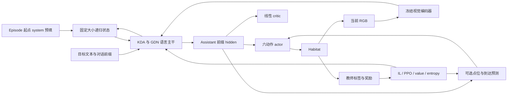

# 架构与状态约定

当前模型为 KDA-converted Qwen3.5-0.8B，策略输入只有 RGB＋目标文本，输出六动作；semantic mask、GPS/compass、上一动作及教师信息不进入策略。任务与固定节点见 [当前版本](current_version.md)。

代码支持可选的双通道 pointing 与到达监督：感知预测参与六动作 logits 的修正，保持同一流式主干和输入约定。固定节点保留无感知分支的实现，感知配置及弱标签限制见 [轻量感知监督](perception.md)。

## 流式模型

Qwen 的六个 full-attention 层（3/7/11/15/19/23）转换为 KDA，18 个 Gated DeltaNet 保留。转换后的 KDA 使用输出 RMS normalization。导航初始化只额外适配六层 KDA mixer 的 60 个张量，以原生 Qwen 的 RGB／文本时序特征及换目标／换图差异为监督；这部分不使用动作或 semantic 标签。转换不保证与原生 Qwen 等价。

Episode 起点预填 system。每帧使用官方 `user(image + goal)` 消息和关闭 thinking 的 assistant 前缀，读取最后 token 的 hidden，送入 actor 与线性 critic。后续帧关闭上一空 assistant 消息后继续输入，不生成文本，不把上一动作写进消息。旧 NAV 参数仅用于兼容其他配置，当前读出路径不使用且不训练。

RGB 是 uint8 HWC/BHWC，传感器输出 480×270，HFOV 120°。上下各补 9 行到 480×288，执行 mean/std=0.5 normalization、temporal repeat 和 spatial merge ordering，得到 135 个视觉 token。服务端其他尺寸使用等比 letterbox。

## 递归状态与梯度

`LayerState` 是 functional `(conv, recurrent)` tensor 对。KDA 不保存增长的 KV history；GDN 保存卷积历史和矩阵状态。当前单环境状态为 32,120,832 bytes，大小不随 episode 步数增长。clone/detach 创建独立 storage，重放不能原地修改 rollout snapshot。

重置 episode 或更换目标时清空状态并重新预填。训练在完整 100 步序列内保留梯度，序列起点 detach；这截断反向传播，不清空模型历史状态。Episode 边界应用新状态。

当前加速训练把独立环境的变长 token 序列拼接，并向 FLA 显式传入长度，各环境状态保持独立，不补零 padding。重放最多合并 64 帧的因果计算，在 episode 边界拆分；不缩短 100 步 BPTT。采集与重放的 batch 宽度匹配，更新前校验动作 log-prob。误差过大时所有 rank 一起减小合并数量，必要时回退逐帧／逐环境计算。详见 [加速与数值保护](training.md#加速与数值保护)。

视觉编码器冻结，其 rollout 输出可缓存；token IDs 可跨步骤缓存，可训练 embedding 的查表结果仅在一次 replay 内复用。下一 minibatch 读取当前参数并新建梯度图。模型服务默认使用独立会话递归状态。

## 仿真与教师

学习器通过 ZeroMQ IPC 与独立 Python 3.9 Habitat 进程通信，使用 JSON header＋uint8 图像 multipart。命令为 `RESET`、`STEP`、`GET_ORACLE_ACTION`、`CLOSE`、`PING`。Episode uid 包含 dataset/split/scene/episode，客户端核对响应 uid。

每个 GPU rank 使用四个训练环境，同步 DDP rollout/replay。语言主干和 actor 解冻后重新建立 DDP reducer，使全部可训练参数参与同步。本实现没有复刻 OVSegDT VER 的异步经验调度。

教师调用固定版本 ObjNavExplorer。地图、位姿与目标视点仅用于教师、奖励和评估。Navmesh 按机体高 0.88 m、半径 0.18 m、max climb 0.10 m、cell height 0.05 m 重建；前进 0.25 m，转向／上下看 30°，`allow_sliding=False`。

当前训练启用 `oracle_execution=collision_safe`。保留上游 frontier／目标选择与 EXPLORE／BEELINE／PIVOT／STOP；用真实 navmesh 检查前进终点，阻塞时使用离散跟随器，并持续跟随同一目标，避免上游朝向规则撤销纠正转向。局部跟随器的 STOP 不转换为物体成功标签。没有可执行动作时记录 oracle unavailable，截断当前有效前缀并重置。

`filter_blocked_forward_labels=true` 只过滤“教师和实际执行都为前进、碰撞且位移不超过步长 5%”的 IL 标签，保留实际转移、PPO、奖励和递归状态。默认 `upstream` 教师执行方式保留用于对照。

## 实现入口

| 路径 | 职责 |
|---|---|
| [models/qwen35_kda](../src/streamnav/models/qwen35_kda/) | 转换、FLA adapter、functional cache、backbone |
| [models/policy](../src/streamnav/models/policy/) | 流式消息读出、actor/critic、动作分布 |
| [training](../src/streamnav/training/) | rollout/replay、GAE、PPO、EALM、DDP、保存 |
| [habitat_server](../services/habitat_server/) | 仿真、机器人参数、教师执行适配 |
| [serving](../src/streamnav/serving/) | 会话 API、batch step、网页回放 |

当前依赖为 Transformers 5.3.0、FLA 0.4.2、Torch 2.10.0+cu126；准确环境版本见节点记录。依赖升级需重新检查 recurrence、梯度、重放概率和完整序列训练。
