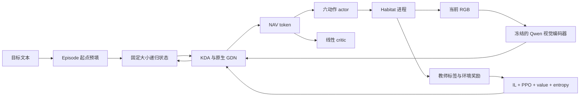

# 架构与状态约定

本文描述 [revision 5](current_version.md)。策略输入固定为 RGB＋目标文本，使用六动作输出，不读取语义 mask、GPS/compass 或上一动作，不使用 semantic loss。

## 模型与数据流

Qwen3.5-0.8B 的 6 个 full-attention 层转换为 KDA，18 个 Gated DeltaNet 保留。转换独立于导航训练；新增 KDA gate 未额外蒸馏，转换前后不保证数值等价。视觉编码器在当前导航配方中冻结。

RGB 为 uint8 HWC/BHWC，传感器输出 480×270（宽×高），HFOV 120°。上下各补 9 行到 480×288，执行 mean/std=0.5 normalization、temporal repeat 和 spatial merge ordering，得到 135 个视觉 token。非目标尺寸的服务输入等比 letterbox，不裁剪或拉伸；当前默认路径使用上述长宽配置。

视觉 token 前后添加图像边界 embeddings，最后追加可学习 NAV token。actor 和线性 critic 共用 NAV hidden state。动作顺序为 STOP、MOVE_FORWARD、TURN_LEFT、TURN_RIGHT、LOOK_UP、LOOK_DOWN，ID 为 0–5。动作几何和机体参数以 [主配置](../configs/config.yaml) 为准。

`LayerState` 为 functional `(conv, recurrent)` tensor 对。KDA 不保留增长的 KV history；GDN 保留长度 3 的卷积历史与矩阵状态。当前配置的单环境状态实测为 32,120,832 bytes，大小不随 episode 步数增加。clone/detach 创建独立 storage，重放不能原地修改 rollout snapshot。

目标在 episode 起点预填，重置或换目标时清空状态并重新预填。训练在完整 100 步序列内保留梯度，序列起点 detach；episode 边界应用新目标状态。采样和重放使用相同 recurrence 路径与 batch 宽度，并在更新前检查 log-prob 一致性。

revision 6 起的诊断配置（当前 `qwen35_0p8b_kda_stable`） 另外将每个目标文本的 token embeddings 独立取均值，加到每步的 NAV query。这样序列起点 detach 后，当前动作仍有显式目标输入及其 embedding 梯度；每步 token 数和递归状态大小保持原值。episode 预填仍执行。revision 5 checkpoint 保持原路径；具体实验差异和证据见训练文档。

revision 7 起在转换 KDA 的各 value head 输出增加 RMS normalization，然后执行原 sigmoid gate 与 O 投影；该选项保存于 checkpoint，旧模型继续使用原计算路径。revision 8 的线性 critic 从零初始化，并单独使用较低学习率；结构与动作接口不变。具体试运行与自主评估见 [训练说明](training.md)。

`ovsegdt_kda_cached` 保持 revision 8 的数值配方，启用冻结视觉编码器的 rollout 输出缓存：每卡 100×4×135×1024 个 BF16 元素，增加 110,592,000 bytes CPU 内存。重放使用该视觉输出，重新读取当前图像边界、目标和 NAV embeddings；不缓存可训练 embeddings 或递归状态的梯度图。原始 RGB 仍保留，便于诊断。视觉参数可训练时拒绝开启缓存，解冻后拒绝使用已有缓存。目标 token IDs 另有容量 256 的 CPU 缓存，目标 embeddings 每次重新计算，保留更新与梯度。

## 仿真与并行

学习器通过本地 ZeroMQ IPC 与独立 Python 3.9 Habitat 进程通信。协议为 JSON header＋原始 uint8 图像 multipart；环境命令为 `RESET`、`STEP`、`GET_ORACLE_ACTION`、`CLOSE`、`PING`。episode uid 包含 dataset/split/scene/episode，客户端核对响应 uid。

单机八卡使用一个同步 DDP 进程组，每 rank 4 个仿真环境。模型解冻后重建 DDP reducer，保证新解冻参数参与梯度同步。训练不复刻上游 VER 的异步调度；具体配方和这一差异见 [训练说明](training.md)。

教师直接调用固定版本 ObjNavExplorer，通过 Habitat 适配层访问地图、位姿、目标视点。特权信息只供教师、奖励和指标使用，不进入策略。导航网格按机体高 0.88 m、半径 0.18 m、max_climb 0.10 m、cell_height 0.05 m 重建并缓存。

模型服务使用 session manager 管理指令与递归状态，提供容量、TTL 和互斥访问。显式 batch API 不允许一个 session 在同一批重复出现。Habitat 网页通过该服务调用策略；详见 [部署说明](deployment.md)。

## 实现入口

| 路径 | 职责 |
|---|---|
| [models/qwen35_kda](../src/streamnav/models/qwen35_kda/) | 转换、FLA kernel adapter、functional cache、backbone |
| [models/policy](../src/streamnav/models/policy/) | NAV pooling、actor/critic、streaming API |
| [training](../src/streamnav/training/) | rollout/replay、GAE、PPO、EALM、DDP、保存与监控 |
| [habitat_server](../services/habitat_server/) | 仿真服务、机器人参数与上游教师适配 |
| [serving](../src/streamnav/serving/) | 会话 API、batch step、浏览器 viewer |

节点环境为 Transformers 5.3.0、FLA 0.4.2、Torch 2.10.0+cu126。升级这些依赖后需重新验证 GPU 数值、状态梯度与完整序列训练；环境快照位置见 [当前版本](current_version.md)。
