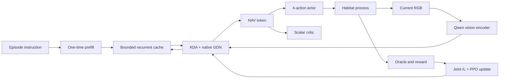

# 架构与状态约定

唯一 backbone 为 Qwen3.5-0.8B，6 个 full-attention 层转换为 KDA，18 个 Gated DeltaNet 保留。转换独立于导航训练；新增 KDA gate 没有预训练蒸馏，不能认为转换前后模型数值等价。

`LayerState` 是 functional `(conv, recurrent)` tensor 对；KDA 没有增长的 KV history，GDN 只保留长度 3 的卷积历史和矩阵状态。整个单环境状态实测为 32,120,832 bytes。状态 cloning/detach 创建独立 storage，重放不能原地修改 rollout snapshot。

输入 RGB 必须为 uint8 HWC/BHWC。当前原始画面为 480×270 / HFOV 120°；patchify 上下各补 9 行到 480×288，执行 Qwen 的 mean/std=0.5 normalization、temporal repeat 和 spatial merge ordering。非目标尺寸的 API 图像等比 letterbox，不裁剪或拉伸；旧整数 image_size 配置保留显式方形 resize 行为。图像边界 embeddings 加到视觉 token 前后，最后追加 learnable NAV token；actor 与 critic 共用该 token。位姿、语义标签、深度、地图和 geodesic 信息从不进入 model 模块。

训练端通过 ZeroMQ 本地 IPC 与独立 Python 3.9 Habitat-Sim 进程通信。协议使用 JSON header + raw uint8 image multipart，不使用 pickle 反序列化网络输入。每个 worker 独立场景、agent、oracle 和 episode，多个请求并行发出，learner 批处理 RGB。

`RESET`、`STEP`、`GET_ORACLE_ACTION`、`CLOSE` 和 `PING` 是全部环境命令。episode uid 包含 dataset/split/scene/episode，客户端检查响应 uid。模型服务的 session manager 在目标改变或 episode 重置时重新 prefill，设有容量限制、TTL 和互斥访问；batch API 禁止同一 session 在同一批中出现两次。

核心实现入口：

- `models/qwen35_kda/`：转换、FLA kernel adapter、functional cache、backbone。
- `models/policy/`：显式 NAV pooling、actor/critic、streaming API。
- `training/`：recurrent rollout/replay、GAE、DAgger、PPO、EALM、checkpoint。
- `services/habitat_server/`：真实仿真器和基于官方目标视点的 oracle。
- `serving/`：会话 API、batch step 和浏览器 viewer。

依赖固定在 Transformers 5.3.0、FLA 0.4.2、Torch 2.10.0+cu126；升级它们之后必须重新跑 GPU 等价性、状态梯度和延迟回归。当前不是多机分布式训练器，支持的是单机多进程仿真 rollout 与独立实验并行。
