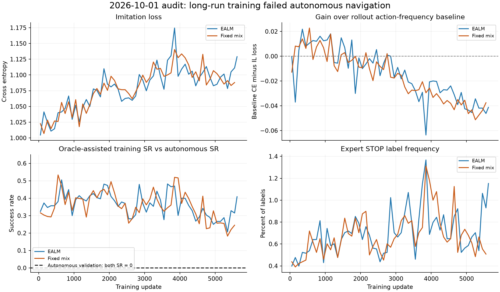

# 2026-10-01 训练失败审计与恢复

> 后续已定位教师 / 课程 reset 问题并迁移到 revision 3 的 8 卡训练；最新结果见 [8 卡审计](training_8gpu_20261001.md)。本页保留首次审计时的历史状态。

旧训练确实没有学出有效的自主导航；此前“工程闭环通过”只能说明代码链路可运行，不能说明导航质量。这次以独立自主验证、确定性动作、真实样本拟合和 recurrent replay 一致性检查学习问题。

## 已确认的结果

| 实验 | 安全停训 update | split 验证记录 | 所有已记录自主 SR / SPL |
|---|---:|---:|---:|
| `streamnav_sensor480x270` | 5,640 | 339 | 0 / 0 |
| `streamnav_sensor480x270_fixed_mix` | 5,600 | 336 | 0 / 0 |

这些是重复的小子集验证记录，不是 675 个独立测试集。旧验证每 split 仅取顺序排列的前 3 个 episode，覆盖集中在同一场景。主训练最后 500 updates 的平均 IL loss 为 1.102，STOP 标签占 0.831%；对照分别为 1.088、0.564%。训练 success 约 29.3% / 23.2% 包含 oracle 接管，不能解读为自主成功率。训练吞吐约 40 replay transitions/s，有梯度、有 GPU 计算，但这些指标不能证明学习有效。

最后 500 updates，相对每个 rollout 动作频率基准的 CE 改善分别为 −0.0422 / −0.0447，未显示稳定超过类别先验的预测收益。图中的训练曲线按 100 updates 分块均值，训练 SR 是每 update 已结束混合策略 episode 的平均数，不是 episode 加权自主成功率。

主模型最终 checkpoint 在另外采集的 32 帧真实 RGB 上全部 argmax 为左转；expert 为 12 前进、11 左转、9 右转，准确率 34.4%。这支持“策略退化为动作偏好”，不支持“只需继续加长训练”。

## 代码缺陷与修复

1. **坍缩检查使用了随机采样动作。** 策略概率仍接近几类动作的边际比例时，采样直方图看起来正常，但 argmax 可以一直左转。现在单独记录 greedy 动作分布、oracle 各类召回、准确率、IL 相对类别先验的改善量；训练 success 明确标注为 DAgger mixture。
2. **监控只关心进程/GPU，未监督自主效果。** 新后台监控读取真实训练和三 split 验证记录，每 30 秒更新健康状态；达到持续失败门槛会 SIGTERM 保存停训，避免继续浪费预算。已通过真实 learner 停训测试：监控自主触发信号，update 3 保存完整 optimizer/权重，退出后状态 `halted_for_review`。
3. **小验证集只覆盖顺序靠前的场景。** 改为固定 seed 的跨场景取样，各 split 12 episodes，每 100 updates 验证，并报告场景/类别数量和自主 greedy 动作分布。依旧只是诊断子集，不能当作完整 benchmark。
4. **网页一直持有启动时权重。** 旧服务约 18 小时仍加载 update 1。现在 `/health` 区分 loaded / latest checkpoint；点击“加载 / 重置”会加载最新完整权重，并清空所有旧 session/cache；不会在 episode 中途替换模型。
5. **同一 run_dir 可无 checkpoint 重启并混写日志。** 现在拒绝；指定恢复 checkpoint 也必须与原目录最后 update 一致。从旧 update 分支需新目录。训练 revision 改变时拒绝恢复不兼容 optimizer。

更早 224 输入实验的源码快照未按机体尺寸重建碰撞网格，实际网格为 1.5 m / 0.1 m，而机体配置不同。这一几何问题此前已在 480×270 实验中修复，本次确认旧实验不应继续使用并清理。

## 排查中没有发现的故障

- 真实 RGB 正常；没有发现把 oracle、位置或目标坐标送入模型。
- 同一 checkpoint 的 rollout 与连续序列 replay：混合行为 log probability 最大误差 0.00283，value 最大误差 0.015625，符合该 BF16 检查的数值规模；没有发现动作标签整体错位或 replay 完全失配。
- 16 个均衡真实样本（每动作 4 个）的独立容量诊断：从转换初始化训练，10 optimizer steps 后训练准确率 100%、CE 0.270；20 steps 后 CE 0.00228。说明这条前后向链路能拟合样本，**不代表泛化或自主导航成功**；诊断权重没有用于正式训练。
- 同一 RGB、不同目标文本的 500 步诊断仍有非零输出差异，最大概率差由第 1 步约 0.0148 到第 500 步约 0.00563。因此不能断言目标信息完全丢失，也未据此重写模型架构。

STOP 极稀少、训练难度和特征漂移是有证据支持的风险因素；尚未证明某一个因素独自导致全部失败。本次修复监控缺陷，同时进行明确标注的新训练配置实验，而不是把超参数修改描述为已证实的根因修复。

## revision 2 恢复实验

两张 GPU 分别运行 `runs/streamnav_recovery_20261001` 和 `runs/streamnav_recovery_20261001_fixed_mix`，后者固定 IL/PPO mixing alpha=0.5；其余配置一致。从转换初始化重新开始，保留唯一 Qwen3.5-0.8B KDA 模型和 online DAgger + PPO + IL 联合范式。

- 主干 / 视觉 / head 学习率为 3e-6 / 1e-6 / 1e-4，视觉仍参与训练。
- STOP IL 类权重 8，其余 1；每个 minibatch 按实际权重均值归一化。false STOP penalty=0.2。
- 前 2,000 updates 的 50% 新训练 episode 由 oracle 在仿真器内先走到较近起点，距离由 1.5 m 逐渐增至 6 m。预行进步数单列，不算模型 transitions；剩余 50% 和所有正式验证保留原始起点。课程数据不能混入原始起点验证。
- 默认 8 env ×16 steps，BPTT 4，sequence batch 8，2 epochs，fused AdamW，BF16 compute / FP32 master；保留已实测的吞吐配置。
- 首轮使用 3 环境完成相同的跨场景子集；随后安全保存恢复，将验证环境数调至 12，以利用批量推理吞吐。第 1 次保存并验证；每 25 updates 保存，每 100 updates 对三个 split 各 12 episodes 验证，最多 500 步，12 环境合批、argmax，无 oracle 接管。
- ≥500 updates 后最近 5 次完整验证 SR 全为零，或最近 50 updates 单一 greedy 动作 ≥95% 且 IL 相对先验改善 <0.05，会自动保存停训；非有限 loss / 30 分钟无 update 也触发停止。不会无限重启失败实验。

这些阈值用于及时暴露失败，不是保证收敛。新实验的实时结果以 `train_metrics.jsonl`、`eval_metrics.jsonl`、`health_status.json` 为准；不能用课程 DAgger 的成功率替代自主模型表现。

## 验证与清理

静态检查通过；30 个 CPU/结构测试、4 个 GPU 测试、3 个真实 Habitat 集成测试全部通过。新增检查覆盖 greedy 坍缩监督、完整验证轮次判断、run_dir 防混写、跨场景确定性取样、权重替换清空 session，以及真实课程起点与验证隔离。另已运行实际保存停训的 watchdog smoke，以及真实浏览器加载/单步检查（原图 480×270、机器人参数正确、无 JavaScript 错误）。网页自动更新权重路径与清空旧 session 的路由也有回归测试；实际服务随后在不重启的情况下从 update 1 切至 update 25 并完成模型单步，见 `viewer_latest_acceptance.log`。

删除 `runs/streamnav_mixed`、`runs/streamnav_fixed_mix`、`runs/streamnav_mixed_oracle_failure`，共约 58.5 GiB。前两者碰撞几何错误，后者是未处理 oracle 异常导致中断的旧运行。删除前保留配置、指标、源码快照和原因，便于复核。

两份 480×270 长训练是有价值的失败证据，保留原始日志/最后权重，并写入 `EXPERIMENT_STATUS.json`，禁止当作有效模型或恢复来源。没有因为 SR 低而删除或美化这些指标。

诊断原始文件都在 `runtime/audit_20261001/`：

- `old_run_summary.json`、`old_runs/`：旧指标及源码快照。
- `replay_probe.json`、`overfit_baseline.json`、`goal_retention.json`：上述诊断结果与对应脚本。
- `checks_v2.log`、`gpu_integration_v2.log`：测试输出。
- `watchdog_acceptance.json`：真实停训验收。
- `deletion_receipt.json`：具体删除目录、字节数及原因。
- `recovery_status.json`：2026-10-01 04:48 UTC 状态快照，主实验 / 对照为 update 35 / 41，learner、监控和保活进程均存活。当时最近 20 updates 优化吞吐约 39.6 / 41.3 replay transitions/s，首次自主验证仍为 SR=0；后续结果应读取实时日志。

另完成 12 环境并行容量检查，三 split 各 12 个不同场景、每 episode 最多 4 步，无 OOM。产物在 `runtime/audit_20261001/batch12_capacity/`，明确标记为容量测试；其中 SR 不用于判断导航质量，也未混入训练的定期验证日志。

启动和使用说明见 [README](../README.md)；监督门槛与恢复规则见 [training](training.md)。
